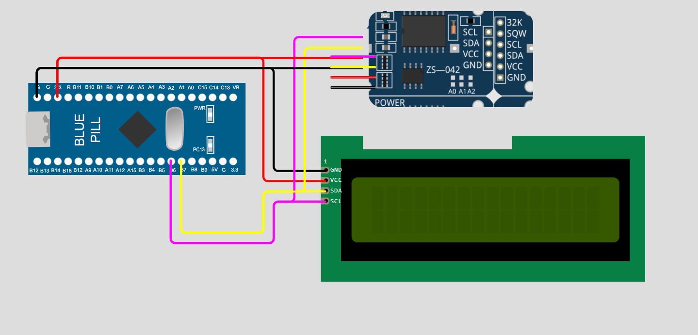

# STM32-Baremetal-Clock

## What is Baremetal Programming?
Baremetal programming refers to developing software directly on the hardware without the use of an operating system or high level abstraction libraries such as (HAL/RTOS). In this type of programming the hardware is accessed directly and the peripherals are configured. This is ideal for applications that have a strict memory and timing constraints. It enables full control over time critical operations. Also the absence of overhead from operating system or abstraction layers makes the execution faster and hence resource utilization is optimal.

## The project
This project leverages the barmetal programming capabilities of STM32. The microcontroller particularly used is the ```STM32F103C8T6``` (aka. bluepill). Paired with the DS3231 I2C Datetime module and the 16x2 I2C LCD Display a clock is made. It shows the Current Date and Time. 

## Snaps of the Project
<p align=center>
  
  <p align=center>Schematic</p>
</p>

<p align=center>
  
  <p align=center>Circuit in action</p>
</p>